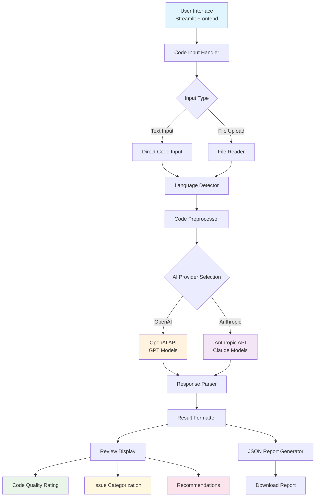

# AI Code Review Assistant

A lightweight Streamlit application that uses AI to review code, detect bugs, suggest improvements, and provide best practice recommendations.

## Project Architecture



### Component Description

- **User Interface**: Streamlit-based web interface for user interaction
- **Code Input Handler**: Manages both direct text input and file uploads
- **Language Detector**: Automatically identifies programming language
- **Code Preprocessor**: Prepares code for analysis and handles formatting
- **AI Provider Integration**: Supports both OpenAI and Anthropic APIs
- **Response Parser**: Processes AI responses into structured data
- **Result Formatter**: Organizes results into user-friendly format
- **Report Generator**: Creates downloadable JSON reports

## Features

- **Code Input Options**
  - Paste code directly into the application
  - Upload code files (.py, .js, .java, etc.)
  - Automatic language detection

- **Comprehensive Review**
  - Code quality assessment
  - Bug and security vulnerability detection
  - Performance optimization suggestions
  - Style and best practice recommendations

- **Customizable Analysis**
  - Support for both OpenAI and Anthropic APIs
  - Multiple model options for each provider
  - Adjustable review depth (Basic, Standard, Comprehensive)

- **User-Friendly Output**
  - Clear organization of review results
  - Severity-based categorization
  - Line-specific feedback
  - Downloadable JSON reports

## Installation

1. Clone this repository:
   ```
   git clone https://github.com/NoLongerHumanHQ/AI-Code-Review-Assistant.git
   cd AI-Code-Review-Assistant
   ```

2. Install the required dependencies:
   ```
   pip install -r requirements.txt
   ```

3. Set up your environment variables:
   - Create a `.env` file based on the provided `.env.example`
   - Add your OpenAI and/or Anthropic API keys

## Usage

1. Start the Streamlit app:
   ```
   streamlit run app.py
   ```

2. Open your web browser and navigate to the URL displayed in the terminal (typically http://localhost:8501)

3. Configure your settings in the sidebar:
   - Select API provider (OpenAI or Anthropic)
   - Enter your API key if not already set in .env
   - Select the AI model
   - Choose review depth

4. Input your code:
   - Paste code directly into the text area, or
   - Upload a code file using the file uploader

5. Click "Analyze Code" to start the review process

6. Review the results:
   - Overall code quality rating
   - Summary of strengths and weaknesses
   - Key recommendations
   - Detailed issue breakdown with severity levels
   - Suggested improvements with code examples

7. Optionally download the report as JSON for future reference

## Supported Languages

The application supports detection and review of multiple programming languages, including:
- Python
- JavaScript
- TypeScript
- Java
- C++
- C
- Go
- Rust
- PHP
- Ruby
- HTML
- CSS
- C#
- Kotlin
- Swift
- And more...

## Configuration Options

### API Providers
- **OpenAI**: Uses GPT models for code review
  - Models: gpt-3.5-turbo, gpt-4, gpt-4-turbo
  
- **Anthropic**: Uses Claude models for code review
  - Models: claude-2, claude-instant-1, claude-3-opus, claude-3-sonnet

### Review Depth
- **Basic**: Quick review focusing on critical issues
- **Standard**: Balanced review covering bugs, style, and common best practices
- **Comprehensive**: In-depth analysis including edge cases, optimizations, and security concerns

## Author

**NoLongerHumanHQ**
- GitHub: [@NoLongerHumanHQ](https://github.com/NoLongerHumanHQ)
- Email: patel.veeru@protonmail.com

## License

This project is licensed under the MIT License - see the [LICENSE](LICENSE) file for details.

## Contributing

Contributions are welcome! Please feel free to submit a Pull Request.

### How to Contribute
1. Fork the repository
2. Create your feature branch (`git checkout -b feature/AmazingFeature`)
3. Commit your changes (`git commit -m 'Add some AmazingFeature'`)
4. Push to the branch (`git push origin feature/AmazingFeature`)
5. Open a Pull Request

## Support

If you encounter any issues or have questions, please:
- Open an issue on GitHub
- Contact me at patel.veeru@protonmail.com

## Acknowledgements

- This project uses the [Streamlit](https://streamlit.io/) framework
- AI-powered code analysis provided by [OpenAI](https://openai.com/) and [Anthropic](https://www.anthropic.com/)
- Special thanks to the open-source community for their valuable contributions

## Changelog

### Version 1.0.0
- Initial release with basic code review functionality
- Support for OpenAI and Anthropic APIs
- Multiple programming language support
- Downloadable JSON reports
